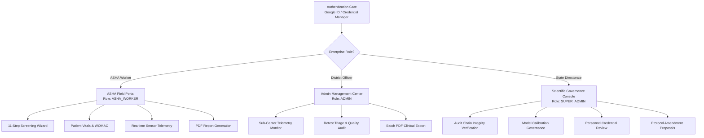

# ARTHROSCAN-NER 
### AI-Assisted Multimodal Musculoskeletal Osteoarthritis Risk Screening & Clinical Research Platform
**Smart India Hackathon 2026 | Problem Statement: SIH26004 | Team: GOD'S PLAN**  
*Target Authority: Ministry of Development of North Eastern Region (MDoNER) & National Health Mission (NHM)*

---

[](#)
[](#)
[](#)
[](#)
[](#)
[](#)
[](#)
[](#)

---

## 1. Executive Summary & Problem Context

In the **North Eastern Region (NER)** of India, complex high-altitude topography, demanding physical agricultural labor, and limited availability of tertiary healthcare infrastructure contribute to a severe prevalence of early-onset **Knee Osteoarthritis (OA)**. Rural outposts, Sub-Centers, and Primary Health Centres (PHCs) lack access to costly, radiation-heavy imaging systems such as MRI or digital radiography.

**ARTHROSCAN-NER** is a portable, non-invasive, radiation-free point-of-care screening and clinical research platform engineered specifically for **Accredited Social Health Activists (ASHA)** and frontline community health workers. By fusing multi-physics biosensing (Radiofrequency dielectric perturbation, Vibroarthrography, Kinematic IMU, and Surface Electromyography) with Google AI Studio (Gemini) clinical intelligence, ARTHROSCAN-NER stratifies early joint degradation risks months before irreversible structural cartilage collapse occurs.

```
       ┌────────────────────────────────────────────────────────┐
       │               ARTHROSCAN-NER ECOSYSTEM                │
       └──────────────────────────┬─────────────────────────────┘
                                  │
      ┌───────────────────────────┴───────────────────────────┐
      ▼                                                       ▼
┌───────────────────────────┐                       ┌───────────────────────────┐
│     FRONTLINE MOBILE      │                       │     CENTRAL RESEARCH      │
│     (Android Compose)     │                       │     (Python & Desktop)    │
├───────────────────────────┤                       ├───────────────────────────┤
│ • ASHA 11-Step Screening  │                       │ • HIL Hardware Simulators │
│ • Google ID Authentication│                       │ • Algorithm Verification  │
│ • Skia Vector PDF Reports │                       │ • Dataset Benchmarking    │
│ • Local Room Database     │                       │ • Governance Protocol Run │
└───────────────────────────┘                       └───────────────────────────┘
```

---

## 2. Core Functional Architecture

The core architecture operates under a **Universal Data Contract (Schema v1.0)**. The identical algorithmic pipeline processes data whether sourced from physical hardware, Hardware-in-the-Loop (HIL) testbenches, CSV replay streams, or deterministic synthetic demonstration generators.

### End-to-End Multimodal Data Pipeline

```mermaid
flowchart TD
    subgraph SENSING ["1. Multi-Physics Ingestion Layer"]
        RF["RF Microwave Sensor<br/>2.45 GHz S11 Dielectric Loading"]
        VAG["Vibroarthrography (VAG)<br/>Acoustic Emission (10-1000 Hz)"]
        IMU["Kinematic 6-DoF IMU<br/>Tibial Angular Rate & Flexion Accel"]
        SEMG["Dual-Channel sEMG<br/>Quadriceps & Hamstring Activity"]
        CTX["Clinical Context<br/>WOMAC Questionnaire & Demographics"]
    end

    subgraph QUALITY ["2. Signal Quality & Preprocessing"]
        QG["Signal Quality Gate (SQI)<br/>Clipping, Dropped Packets & SNR Verification"]
        FLT["Digital Signal Preprocessing<br/>Butterworth Bandpass, Rectification & Wavelet De-noising"]
    end

    subgraph FEATURES ["3. Provenance Feature Store"]
        FS["Feature Extraction Engine<br/>• Crepitus Power Density<br/>• Co-Contraction Index (CCI)<br/>• Dielectric Reflection Shift<br/>• Range of Motion (ROM) Velocity"]
    end

    subgraph REASONING ["4. Late-Fusion & Uncertainty Engine"]
        FUSION["Reliability-Weighted Multimodal Late Fusion<br/>Modality Reliability Calibration (Seed: 26004L)"]
        UNCERT["Calibrated Uncertainty Model<br/>Epistemic (Model) + Aleatoric (Signal Noise)"]
    end

    subgraph INTELLIGENCE ["5. Google Ecosystem & Clinical Output"]
        GEMINI["Google AI Studio / Gemini 1.5<br/>Explainable Clinical Narrative Synthesis"]
        REPORT["Dual-Engine PDF Generator<br/>Skia Native Vector PDF + SHA-256 Hash"]
        NOTIF["Android System Notification<br/>Channel: arthroscan_downloads"]
        TRIAGE["Clinical Triage & Action Guidance<br/>LOW • MODERATE • HIGH RISK"]
    end

    SENSING --> QUALITY
    QUALITY --> FEATURES
    FEATURES --> REASONING
    REASONING --> INTELLIGENCE
```



---

## 3. Sensor Modalities & Physical Principles

| Modality | Physical Target | Clinical Significance in Early OA | Primary Metric |
| :--- | :--- | :--- | :--- |
| **Radiofrequency (RF)** | Dielectric permittivity ($\varepsilon_r$) & conductivity ($\sigma$) at 2.45 GHz | Detects sub-surface synovial fluid effusion, water binding changes, and deep articular cartilage matrix dehydration | S11 Reflection Return Loss (dB) & Resonance Frequency Shift |
| **Vibroarthrography (VAG)** | Sub-audible acoustic emissions & micro-vibrations | Captures friction and roughness between patellofemoral and tibiofemoral articular surfaces during motion | Acoustic Crepitus Burst Rate & High-Frequency Power Density (HF-VAG) |
| **Inertial Measurement (IMU)** | Tibial 3D acceleration and angular velocity | Quantifies gait kinematic instability, asymmetric angular deceleration, and joint stiffness | Active Range of Motion (ROM) & Angular Jerk Peak |
| **Surface EMG (sEMG)** | Vastus Medialis & Biceps Femoris electromyography | Identifies compensatory muscular guarding, neuromuscular latency, and abnormal co-activation | Co-Contraction Index (CCI) & Root Mean Square (RMS) Envelope |
| **Clinical Context** | Patient demographics, rural occupational load, history | Incorporates validated clinical scoring (WOMAC Index) and ergonomic strain | Standardized WOMAC Index (0–96 scale) |

---

## 4. Google Stitch AI-Native Design System

The mobile user interface of ARTHROSCAN-NER was designed and structured utilizing **Google Stitch's AI-native "Vibe Design" paradigm** and implemented in native **Android Jetpack Compose (Material 3)**.

Google Stitch bridges conversational design intent into high-fidelity code. The application implements an **Apple Health + Material You + Medical Research Instrumentation** design language:

```
┌────────────────────────────────────────────────────────┐
│               GOOGLE STITCH DESIGN SYSTEM              │
├──────────────────────────┬─────────────────────────────┤
│ Typography Hierarchy     │ • Display / Title: Sora     │
│                          │ • Body / Nav: Space Grotesk │
│                          │ • Telemetry: JetBrains Mono │
├──────────────────────────┼─────────────────────────────┤
│ Visual Polish            │ • 8dp/16dp Pill Shapes      │
│                          │ • Sub-surface Elev. (1-4dp) │
│                          │ • Glassmorphism Tinting     │
├──────────────────────────┼─────────────────────────────┤
│ Accessibility & Clarity  │ • Zero Cramped Text Blocks  │
│                          │ • Contrast AA Compliant     │
│                          │ • High-Tension Status Badges│
└──────────────────────────┴─────────────────────────────┘
```

### Micro-Typography Standard
- **Brand & Headings**: `Sora` (Geometric, clean, medical-grade authority).
- **Body, Captions, Labels & Buttons**: `Space Grotesk` (Technical, readable, modern sans).
- **Sensors, Hashes, Decibels, Timestamps, and Coordinates**: `JetBrains Mono` (Zero ambiguity, monospace precision).

### Color System Token Matrix
- **Base Background**: `SurfaceLevel0_Background` (`#0A0E17` Dark / `#F8FAFC` Light)
- **Primary Surfaces**: `SurfaceLevel1_Primary` (`#111827` Dark / `#FFFFFF` Light)
- **Elevated Controls**: `SurfaceLevel2_Elevated` (`#1F2937` Dark / `#F1F5F9` Light)
- **Clinical Accent**: `MedicalAccentTeal` (`#0D9488` / `#14B8A6`)
- **Brand Anchor**: `ArthroscanBlue` (`#2563EB` / `#3B82F6`)
- **Audit & Cryptographic Status**: `TamperEvidentGreen` (`#10B981`)
- **Risk Tiers**:
  - `RiskLowGreen`: `#10B981` (Normal articulation, annual review)
  - `RiskModerateAmber`: `#F59E0B` (Early degenerative stress, physical therapy)
  - `RiskHighRed`: `#EF4444` (Severe cartilage thinning, specialist orthopedic referral)

---

## 5. Google Ecosystem & Cloud Integration

### A. Google AI Studio & Gemini Integration
The application connects with **Google AI Studio** through the server-side and mobile Gemini API capabilities:
- **Environment Management**: Key stored in `.env` (`GEMINI_API_KEY`) and auto-injected via the Secrets Gradle Plugin into `BuildConfig.GEMINI_API_KEY`.
- **Explainable Clinical AI (XAI)**: Synthesizes complex multi-modal sensor vectors into actionable, localized patient explanations in plain language for ASHA workers.
- **Multimodal Narrative Generation**: Translates raw signal features (CCI, S11, acoustic peaks) into structured clinical referral notes.

### B. Google Jetpack Credential Manager
- Replaced outdated legacy auth dialogs with the official **Android Jetpack Credential Manager** (`androidx.credentials:credentials:1.5.0`) and Google Identity (`com.google.android.libraries.identity.googleid:googleid:1.1.1`).
- Implements `GetGoogleIdOption` for verified Google ID token acquisition.
- Seamlessly resolves Google accounts against the platform’s strict enterprise **Role-Based Access Control (RBAC)** matrix.

### C. Android System Notifications & FileProvider
- Registered notification channel: `arthroscan_downloads` (Importance: `HIGH`).
- When a clinical report or governance audit trail is exported, an Android system notification is fired with an interactive **`[ OPEN PDF ]`** action button.
- Utilizes `FileProvider` (`com.aistudio.arthroscan.rfknee.fileprovider`) with `FLAG_GRANT_READ_URI_PERMISSION` to securely open generated PDFs in Google Drive PDF Viewer, Samsung Notes, or Adobe Reader.

---

## 6. Role-Based Access Control (RBAC) Matrix

ARTHROSCAN-NER enforces strict multi-tenant clinical boundaries:



| User Profile | Role Tier | Target Institution | Permissions |
| :--- | :--- | :--- | :--- |
| **Anita Deka** (`asha.anita`) | `ASHA_WORKER` | PHC Rampur - Sub-Center 04 | Run screening workflows, capture sensor streams, view local history, export individual patient PDFs. |
| **Dr. B. K. Sarma** (`admin.dho`) | `ADMIN` | District Health Office, Kamrup | Review district-wide screening throughput, inspect sensor quality anomalies, manage re-test queues. |
| **Directorate Lead** (`superadmin`) | `SUPER_ADMIN` | State Health Directorate, Assam | Cryptographic audit trail verification, protocol parameter governance, user lifecycle approval/suspension. |

---

## 7. The 11-Step Clinical Screening Workflow

The ASHA mobile portal guides the operator through a standardized 11-step clinical protocol:

1. **Step 01 — Hardware & Sensor Connection**: Connects and checks RF probe, acoustic sensor, IMU band, and sEMG leads.
2. **Step 02 — Patient Registration**: Captures Unique Health ID (ABHA/National ID), age, gender, occupation, and symptomatic knee side.
3. **Step 03 — Sensor Calibration & Baseline**: Computes baseline air-reference dielectric S11 and neutral IMU bias.
4. **Step 04 — RF Microwave Measurement**: Contact dielectric scan at 2.45 GHz across medial/lateral joint lines.
5. **Step 05 — Acoustic Vibroarthrography (VAG)**: Records acoustic emissions through 5 controlled extension-flexion knee cycles.
6. **Step 06 — Kinematic IMU & Dynamic sEMG**: Measures range of motion velocity and quadriceps-hamstring activation envelopes.
7. **Step 07 — Clinical Context & WOMAC**: 5-question targeted functional disability survey.
8. **Step 08 — Quality Gate & SQI Verification**: Automatic algorithmic validation for motion artifact, clipping, or dropped packets.
9. **Step 09 — Multimodal Inference & AI Analysis**: Local reliability-weighted late fusion processing.
10. **Step 10 — Clinical Result & Uncertainty Display**: Composite Multimodal Score, calibrated Epistemic & Aleatoric uncertainty grid, risk classification.
11. **Step 11 — Clinical Summary & Action Plan**: Final referral recommendations, immediate PDF generation, and download confirmation.

---

## 8. Repository Structure & Directory Map

```text
OSTEO-main/
├── .env.example                     # Environment template for Gemini API key
├── metadata.json                    # Platform capabilities declaration
├── build.gradle.kts                 # Root Gradle build configuration
├── settings.gradle.kts              # Multi-project module declarations
│
├── app/                             # Native Android Application (Compose)
│   ├── build.gradle.kts             # Dependencies: Compose, Credentials, Gemini, Room
│   └── src/
│       ├── main/
│       │   ├── AndroidManifest.xml  # Permissions, Services, FileProvider
│       │   ├── java/com/example/
│       │   │   ├── MainActivity.kt  # Root navigation router & authentication state
│       │   │   ├── admin/           # District Health Officer management screens
│       │   │   ├── ai/              # Local inference engines & multimodal fusion
│       │   │   ├── auth/            # GoogleAuthService, AuthRepository, RBAC models
│       │   │   ├── core/            # App constants, seeds, clinical boundaries
│       │   │   ├── domain/          # Business logic contracts & session models
│       │   │   ├── hardware/        # BLE/USB sensor stream drivers & simulators
│       │   │   ├── portal/          # ASHA field screening wizard & steps (01-11)
│       │   │   ├── report/          # Skia Vector PDF generation & Notification service
│       │   │   ├── superadmin/      # State Directorate governance & audit console
│       │   │   └── ui/theme/        # Google Stitch design system, fonts & color tokens
│       │   └── res/                 # Vector drawables, fonts (Sora, Space Grotesk, Mono)
│       └── test/                    # Android Unit tests (Robolectric, RBAC, Fusion)
│
├── python-core/                     # Scientific Research Core & Model Benchmarking
│   ├── pyproject.toml               # Python package configuration
│   ├── requirements.txt             # NumPy, SciPy, PyTorch, Scikit-learn
│   └── arthroscan/
│       ├── ai/                      # Multimodal late-fusion algorithms
│       ├── features/                # Signal processing & feature extraction
│       ├── hardware/                # Serial/BLE hardware bridge interfaces
│       └── preprocessing/           # Butterworth bandpass filters & wavelet de-noising
│
├── desktop/                         # Workstation & Laboratory Research Console
│   └── app.py                       # Desktop dashboard for laboratory HIL evaluation
│
├── configs/                         # Calibration parameters (demo, hardware, production)
├── schemas/                         # Universal Data Contract JSON schemas (v1.0)
└── datasets/                        # Benchmark signal recordings (VAG, RF, IMU, sEMG)
```

---

## 9. Setup & Installation Guide

### Prerequisites
- **Android Studio**: Ladybug (2024.2.1+) or newer with Android SDK 36.
- **Java Development Kit (JDK)**: JDK 17 or JDK 21 (bundled Android Studio JBR supported).
- **Physical Device / Emulator**: Android 14+ (API Level 34–36) with Developer Mode & USB Debugging enabled.
- **Python (Optional for Research Core)**: Python 3.10+ with `pip`.

### 1. Environment Configuration
Clone the repository and create your local `.env` file in the project root:
```bash
cp .env.example .env
```
Open `.env` and configure your **Google AI Studio (Gemini) API Key**:
```properties
GEMINI_API_KEY=YOUR_GEMINI_API_KEY_HERE
```

### 2. Building & Running the Android App
Using the included Gradle wrapper:
```bash
# Execute local unit test suite (RBAC, PDF, Multimodal Fusion)
./gradlew testDebugUnitTest

# Assemble Debug APK
./gradlew assembleDebug

# Install directly to connected device
adb install -r app/build/outputs/apk/debug/app-debug.apk

# Launch Main Activity
adb shell am start -n com.aistudio.arthroscan.rfknee/com.example.MainActivity
```

### 3. Running the Python Scientific Core
```bash
cd python-core
python3 -m venv venv
source venv/bin/activate
pip install -r requirements.txt
python3 -m pytest tests/
```

---

## 10. Research Governance & Clinical Disclaimers

> [!IMPORTANT]
> **SCREENING & CLINICAL REFERRAL SUPPORT ONLY**
> ARTHROSCAN-NER is an investigational medical decision-support instrument developed under Smart India Hackathon 2026 guidelines.
> - This software **DOES NOT** provide definitive medical diagnoses.
> - This system **DOES NOT** replace standard radiological imaging (X-ray, MRI, CT) or physical evaluation by a licensed orthopedic surgeon.
> - All algorithmic decisions are governed under deterministic audit seed `26004L` and Clinical Trial Research Protocol `AMCH-NER-ETH-2026-081B`.

---

## 11. Contributors & Acknowledgments

Developed by **Team GOD'S PLAN** for **Smart India Hackathon 2026**:
- Dedicated to the frontline health workers (ASHA) and rural communities of Assam, Meghalaya, Arunachal Pradesh, Nagaland, Manipur, Mizoram, Tripura, and Sikkim.
- Special recognition to the **Ministry of Development of North Eastern Region (MDoNER)** and **Google Developer Technologies** (Google Stitch, Google AI Studio, Jetpack Compose).
